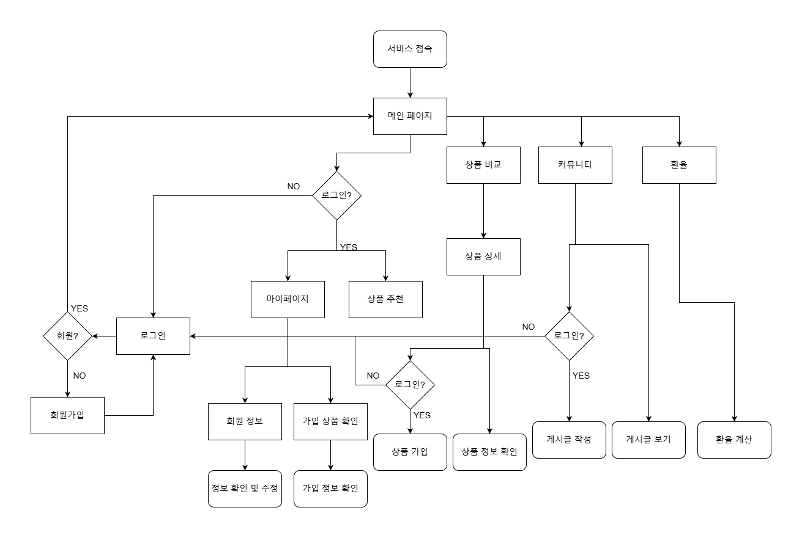
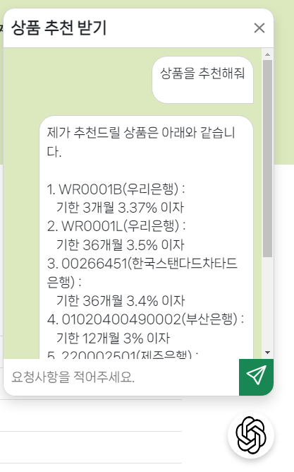

# final-pjt

본 README는 팀원 기여 내역, 느낀점 등을 정리한 문서입니다. 프로젝트의 전반적인 설계 및 구현 사항을 포함하여 작업 내역과 주요 기여를 확인할 수 있습니다.

---
## 사용한 스택


## 프로젝트 실행 방법

1. **설치**:

   ```bash
   git clone https://lab.ssafy.com/kmc4889/final-pjt.git
   cd final-pjt
   ```

2. 사용 방법:
   - back환경 구현

   ```bash
   cd final-pjt-back/
   python -m venv venv
   source venv/Scripts/activate 
   pip install -r requirements.txt
   python manange.py migrate
   python loaddata db.json
   python mananage.py runserver
   ```

    - *파일 생성*

   ```env
   .env
   FIN_API_KEY='금융감독원APIKEY'// https://finlife.fss.or.kr/finlife/main/contents.do?menuNo=700029
   EX_API_KEY='한국수출입은행APIKEY' //https://www.koreaexim.go.kr/ir/HPHKIR020M01?apino=2&viewtype=C&searchselect=&searchword=
   NaverPassword='네이버AppPassword'
   ```

   - front환경 구현

   ```bash
   cd final-pjt-front/
   npm i
   npm run dev
   ```

    - *파일 생성*

   ```env
   .env.local
   VITE_KAKAOJS_KEY='카카오JSKEY'
   VITE_KAKAORS_KEY='카카오RSKEY'
   VITE_GPT_KEY='GPTAPIKEY'//gpt4-mini
   ```

## 팀원 정보 및 업무 분담

| 이름   | 주요 역할         | 기여 내용 요약                                                                                       |
|--------|------------------|-----------------------------------------------------------------------------------------------------|
| 김민철 | 백엔드 개발        | 회원가입 기능, 금융상품 저장 기능, 게시글 및 댓글 CRUD, 중복 금융상품 가입 오류 처리, 이메일 발송 기능 구현, 등 |
| 김지원 | 프론트엔드 개발    | 페이지네이션, CSS 수정, 로그인/회원가입 기능, 금융상품 상세 및 가입 기능, 환율 계산기 및 마이페이지 구현, 등 |

---

## 설계 내용 및 실제 구현 정도

### 모델 설계

- **User**<br>


- **Product 전체 구성**<br>


- **Product 적금**<br>


- **Product 예금**<br>


### 시스템 흐름도


### 설계 내용

- **백엔드**: 사용자 인증, 금융상품 저장 및 관리, CRUD 모델 설계, 환률 기능 설계
- **프론트엔드**: 사용자 친화적인 UI/UX 개발, 페이지네이션 및 레이아웃 최적화, 지도 기능 설계, CRUD 기능 설계

### 실제 구현 정도

- 주요 기능 1: 회원가입 및 로그인 기능
  - 회원 정보 수정 및 비밀번호 변경 (완료)
  - 회원정보에 주소, 이메일 등 다양한 데이터 작성 (완료)
  - 주소 작성 시 실제 있는 주소만 들어갈 수 있도록 작성 (완료)
  - 회원 삭제 기능 구현 (완료)
  - 가입한 상품 목록 조회(완료)

- 주요 기능 2: 예적금 비교 및 금융상품 추천
  - 예적금 데이터 수신 및 데이터 최신화(완료)
  - 은행에 따른 데이터 정리기능 구현(완료)
  - gpt를 이용한 금융상품 추천(완료)
  - 예금 모델 가입기능 구현(완료)
  - 관리자 기능을 이용한 예적금 데이터 수정 및 Email 발송 (완료)
  
- 주요 기능 3: 댓글, 게시글 CRUD 및 좋아요 기능
  - 게시글 CRUD(완료)
  - 게시글 좋아요 및 갯수 갱신(완료)
  - 댓글 CRUD(완료)
  - 댓글 좋아요 및 좋아요 수(필요 없는 기능이라 판단하에 제거)
  - articleType을 이용해 게시글[공지사항, 자유게시판] 분류기능 (완료)

- 주요 기능 4 : 환률 기능 구현
  - 기한 30일 내 환율 받아오기(완료)
  - 일정 기간 외 환율 삭제(완료)
  - 환율을 이용한 변경금액 계산(완료)
  - 환율 최신내역 차트화(완료)
  - 나라별 데이터 수정 및 받아온 데이터 정렬(완료)

- 주요 기능 5: 지도 기능 구현
  - 카카오 API를 이용한 지도 데이터 받아오기(완료)
  - 카카오 API를 이용한 검색 기능 구현(완료)
  - User의 집, 현재위치를 기반으로 검색할 수 있는 기능 구현(완료)
  - 검색바에 주소를 작성하면 해당 위치 근처의 은행 검색기능 구현(완료)
  - 모든 은행 또는 특정 은행 찾기 기능 구현 (완료)

- 중간에 추가한 항목
  - 관리자 계정 추가 (완료)
  - 제품 코드로 조회 후 변경된 내용이 있을 시 업데이트(완료)
  - `db.json`에 gpt를 이용한 더미데이터 생성(완료)

---

## 세부 기여 내역 정리

### 김민철

| 작업 날짜  | 작업 내용                                | 세부 설명                                                                              |
|------------|-----------------------------------------|---------------------------------------------------------------------------------------|
| 2024-11-18 | 회원가입 기능 구현                      | 사용자 관리 백엔드 로직 개발                                                          |
| 2024-11-18 | 예금 모델 구현                        |  products app에 모델 생성 및 ERD 작성, 작성(ERD,ProductApp) 및 API기능 추가          |
| 2024-11-19 | 환율관련 기능 구현                      | 환률 관리 백엔드 로직 개발, exchange 모델 작성 및 관련 기능 추가(일정 기간의 데이터만 저장하도록) |
| 2024-11-19 | 적금 모델 구현                        |  products app에 모델 생성 및 ERD 작성, 작성(ERD, ProductApp) 및 API기능 추가          |
| 2024-11-19 ~ 11-20 | KAKAOMAP기능 구현         |  회원가입된 주소 기반 주변 은행 검색, 현재 위치 기반 주변 은행 검색, 검색어 기반 주변 은행 검색 기능 구현   |
| 2024-11-20 | 회원탈퇴 기능 추가 구현                 | 회원 탈퇴 기능 구현                                            |
| 2024-11-20 ~ 11-26 | 예적금 상품 추천 기능 구현              | 작성된 모델을 바탕으로 api를 통해 데이터를 가져오는 기능, 가입된 상품 CRUD 기능 구현       |
| 2024-11-21 | 게시글 및 댓글 CRUD 기능                | 게시글 및 댓글 생성/조회/수정/삭제, 좋아요 기능 포함                                  |
| 2024-11-21 | 중복 금융상품 가입 오류 처리            | 중복 가입 방지 및 상태 메시지 표시                                                   |
| 2024-11-22 | 상품 추천 알고리즘 추가 | 로그인된 사태에서 address, 가입된 상품, 현재 나와있는 상품목록을 str화 시키고 이를 이용해 메시지 GPTAPI를 이용해 값을 받아오는 기능 구현|
| 2024-11-22 | 게시글 좋아요 기능 추가 | 게시글 좋아요 기능 추가|
| 2024-11-25 | 관리자 기능을 이용한 예적금 옵션 추가 API 작성      | Admin 계정을 이용한 예적금 추가 기능 API 구현              |
| 2024-11-25 | 이메일 발송 기능                        | 가입된 사용자에게만 이메일 발송 기능 구현                                             |
| 2024-11-26 | status 관련 수정 및 코드 정리   | 불필요한 `console.log` 정리 및 http.status 기능 추가              |

### 김지원

| 작업 날짜  | 작업 내용                                | 세부 설명                                                                              |
|------------|-----------------------------------------|---------------------------------------------------------------------------------------|
| 2024-11-18 | 시스템 설계                            | 시스템 흐름도 작성 |
| 2024-11-18 | 내비게이션 바 | bootstrap 활용 내비게이션 바 구현 |
| 2024-11-18 | 로그인 및 회원가입 관련 기능            | 로그인, 회원 가입 페이지 구현, 회원가입 후 자동 로그인, 성공 시 메인 페이지로 이동|
| 2024-11-18 | 마이페이지 회원 정보 수정 기능 | 회원 정보 불러오기, 회원 정보 변경 요청|
| 2024-11-19 | 회원 정보 수정 관련 모달 | 회원 비밀번호 변경, 회원 탈퇴 모달 컴포넌트 및 기능 구현 |
| 2024-11-19 | 전체 상품 페이지 구현 | 예금, 적금 별 상품 비교 가능 |
| 2024-11-19 | 금융상품 상세 및 가입 기능              | 상품 옵션 선택 모달 및 상세 정보 제공                                                 |
| 2024-11-20 ~ 11-21 | 가입한 상품 페이지 구현 | 마이페이지에서 사용자가 가입한 상품을 불러와 상품 금리 정보를 chart로 볼 수 있도록 구현 |
| 2024-11-20 ~ 11-22 | 은행 찾기 페이지         | 은행 찾기 페이지 구현, 직전 검색 방법으로 특정 은행만 재검색하는 기능 추가                          |
| 2024-11-21 | 환율 계산기 및 페이지 구현              | 환율 계산기, 지난 환율 보기, 페이지 레이아웃 정리                                      |
| 2024-11-22 ~ 11-24 | 댓글 및 게시글 페이지네이션 구현        | UI/UX 개선을 위한 페이지네이션 추가                                                   |
| 2024-11-25 | 챗봇 모달 구현 | 모든 페이지에서 챗봇을 볼 수 있도록 위치 고정 |
| 2024-11-25 | 공지사항 게시판  | 공지사항 게시판 구현, 관리자 계정만 게시글 작성 가능 | 
| 2024-11-25 ~ 11-26 | 상품 옵션 추가 및 수정 기능 구현 | 관리자일 경우 상품 옵션의 금리 등을 변경 가능 |
| 2024-11-26 | 메인페이지 | 메인페이지 최근 게시글 보기 구현 |
| 2024-11-26 | 환율 차트 | 환율 비교를 table에서 chart로 변경 | 

---

## 금융상품 추천 알고리즘 기술적 설명(생성형 AI 사용)

### 사용 방법(로그인 후에 이용 가능)
   1. 우측 하단에 GPT 버튼을 누른다 <br>
      
   2. 상품 추천 버튼을 누른다.<br>
      
   3. 추천된 상품을 받는다.<br>
      


### 입력 프롬프트 및 사용 데이터 설명
   1. stores 의 useUserStore에서 사용자의 주소와 가입한 상품의 리스트를 받아오고, useProductStore에서 예금과 적금 상품 목록을 가져옵니다.
   2. 예금과 적금 목록을 정리해 사용할 메시지로 정리합니다. 여기서 상품코드, 은행, 저장기간, 이자를 받아옵니다.
      - 예시
        - 예금 상품은 다음과 같아: 우리은행에서 WR0001B의 코드로<br>
           1개월 3% 이자<br>
           , 3개월 3.37% 이자<br>
           , 6개월 3.42% 이자<br>
           , 12개월 3.37% 이자<br>
           , 24개월 2.7% 이자<br>
           , 36개월 2.7% 이자<br>
   3. 이를 조합해 프롬프트를 만들어 `gpt-4o-mini`에 요청을 보냅니다.
   
### 입력 메시지 GPT프롬프트 예시
<details>
   <summary>입력 메시지 GPT프롬프트 </summary>
   <div>
      너는 유능한 투자관리자야. 나는 현재 광주 광산구 하남마항로 26에 살고 있고, <br>
      내 주변에서 가입할 수 있는 적금상품과 예금상품은 아래와 같아 <br>
         예금 상품은 다음과 같아: 우리은행에서 WR0001B의 코드로  <br>
      1개월  3% 이자 <br>
      , 3개월  3.37% 이자 <br>
      , 6개월  3.42% 이자 <br>
      , 12개월  3.37% 이자 <br>
      , 24개월  2.7% 이자 <br>
      , 36개월  2.7% 이자 <br>
      , 한국스탠다드차타드은행에서 00320342의 코드로  <br>
      1개월  3% 이자 <br>
      , 3개월  3.4% 이자 <br>
      , 6개월  3.35% 이자 <br>
      , 12개월  3.1% 이자 <br>
      , 아이엠뱅크에서 10511008000996000의 코드로  <br>
      6개월  2.22% 이자 <br>
      , 12개월  2.91% 이자 <br>
      , 24개월  2.78% 이자 <br>
      , 36개월  2.8% 이자 <br>
      , 아이엠뱅크에서 10511008001004000의 코드로  <br>
      3개월  1.82% 이자 <br>
      , 6개월  2.32% 이자 <br>
      , 12개월  3.01% 이자 <br>
      , 24개월  2.88% 이자 <br>
      , 36개월  2.9% 이자 <br>
      , 아이엠뱅크에서 10511008001166004의 코드로  <br>
      12개월  3.05% 이자 <br>
      , 아이엠뱅크에서 10511008001278000의 코드로  <br>
      1개월  2.1% 이자 <br>
      , 3개월  3.3% 이자 <br>
      , 6개월  3.15% 이자 <br>
      , 12개월  3.1% 이자 <br>
      , 24개월  2.88% 이자 <br>
      , 36개월  2.9% 이자 <br>
      , 부산은행에서 01030500510002의 코드로  <br>
      1개월  2.25% 이자 <br>
      , 3개월  2.45% 이자 <br>
      , 6개월  2.55% 이자 <br>
      , 12개월  2.75% 이자 <br>
      , 24개월  2.5% 이자 <br>
      , 36개월  2.5% 이자 <br>
      , 부산은행에서 01030500560002의 코드로  <br>
      1개월  2.05% 이자 <br>
      , 3개월  2.6% 이자 <br>
      , 6개월  2.85% 이자 <br>
      , 12개월  3% 이자 <br>
      , 24개월  2.25% 이자 <br>
      , 36개월  1.95% 이자 <br>
      , 부산은행에서 01030500600002의 코드로  <br>
      6개월  2.95% 이자 <br>
      , 12개월  3.15% 이자 <br>
      , 광주은행에서 TD11300027000의 코드로  <br>
      12개월  3.01% 이자 <br>
      , 24개월  2.95% 이자 <br>
      , 36개월  2.79% 이자 <br>
      , 광주은행에서 TD11300031000의 코드로  <br>
      1개월  2.81% 이자 <br>
      , 3개월  2.96% 이자 <br>
      , 6개월  3.01% 이자 <br>
      , 12개월  2.91% 이자 <br>
      , 24개월  2.85% 이자 <br>
      , 36개월  2.69% 이자 <br>
      , 광주은행에서 TD11300035000의 코드로  <br>
      12개월  2.81% 이자 <br>
      , 광주은행에서 TD11300036000의 코드로  <br>
      3개월  3.3% 이자 <br>
      , 6개월  3.35% 이자 <br>
      , 12개월  3.3% 이자 <br>
      , 제주은행에서 101272000006의 코드로  <br>
      1개월  2.4% 이자 <br>
      , 3개월  2.5% 이자 <br>
      , 6개월  2.65% 이자 <br>
      , 12개월  2.85% 이자 <br>
      , 24개월  2.95% 이자 <br>
      , 36개월  3.05% 이자 <br>
      , 제주은행에서 101272000057의 코드로  <br>
      1개월  1.8% 이자 <br>
      , 3개월  2.1% 이자 <br>
      , 6개월  2.5% 이자 <br>
      , 12개월  2.6% 이자 <br>
      , 24개월  2.5% 이자 <br>
      , 36개월  2.5% 이자 <br>
      , 제주은행에서 101272000058의 코드로  <br>
      3개월  2.1% 이자 <br>
      , 6개월  2.25% 이자 <br>
      , 12개월  2.45% 이자 <br>
      , 전북은행에서 10-01-20-024-0046-0000의 코드로  <br>
      3개월  3.4% 이자 <br>
      , 6개월  3.5% 이자 <br>
      , 12개월  3.35% 이자 <br>
      , 전북은행에서 10-01-20-024-0059-0000의 코드로  <br>
      12개월  3.25% 이자 <br>
      , 24개월  null% 이자 <br>
      , 36개월  null% 이자 <br>
      , 경남은행에서 21001115의 코드로  <br>
      3개월  2.35% 이자 <br>
      , 6개월  2.4% 이자 <br>
      , 12개월  2.65% 이자 <br>
      , 24개월  2.75% 이자 <br>
      , 경남은행에서 21001203의 코드로  <br>
      6개월  2.8% 이자 <br>
      , 12개월  2.95% 이자 <br>
      , 24개월  2.9% 이자 <br>
      , 경남은행에서 21001266의 코드로  <br>
      3개월  2.35% 이자 <br>
      , 6개월  2.35% 이자 <br>
      , 12개월  2.35% 이자 <br>
      , 중소기업은행에서 01211310121의 코드로  <br>
      12개월  2.95% 이자 <br>
      , 24개월  2.9% 이자 <br>
      , 36개월  2.85% 이자 <br>
      , 중소기업은행에서 01211310130의 코드로  <br>
      6개월  3.17% 이자 <br>
      , 12개월  2.99% 이자 <br>
      , 24개월  2.88% 이자 <br>
      , 36개월  2.77% 이자 <br>
      , 한국산업은행에서 06492의 코드로  <br>
      1개월  2.9% 이자 <br>
      , 3개월  3% 이자 <br>
      , 6개월  3.1% 이자 <br>
      , 12개월  3.2% 이자 <br>
      , 24개월  2.85% 이자 <br>
      , 36개월  2.85% 이자 <br>
      , 국민은행에서 010300100335의 코드로  <br>
      1개월  1.8% 이자 <br>
      , 3개월  2.2% 이자 <br>
      , 6개월  2.3% 이자 <br>
      , 12개월  2.5% 이자 <br>
      , 24개월  2.6% 이자 <br>
      , 36개월  2.6% 이자 <br>
      , 신한은행에서 200-0134-16의 코드로  <br>
      1개월  2.15% 이자 <br>
      , 3개월  2.45% 이자 <br>
      , 6개월  2.55% 이자 <br>
      , 12개월  2.6% 이자 <br>
      , 신한은행에서 200-0135-12의 코드로  <br>
      1개월  2.15% 이자 <br>
      , 3개월  2.45% 이자 <br>
      , 6개월  2.55% 이자 <br>
      , 12개월  2.6% 이자 <br>
      , 24개월  2.6% 이자 <br>
      , 36개월  2.6% 이자 <br>
      , 농협은행주식회사에서 10-003-1225-0001의 코드로  <br>
      1개월  2.95% 이자 <br>
      , 3개월  3.25% 이자 <br>
      , 6개월  3.35% 이자 <br>
      , 12개월  3.32% 이자 <br>
      , 농협은행주식회사에서 10-003-1381-0001의 코드로  <br>
      12개월  2.75% 이자 <br>
      , 24개월  2.65% 이자 <br>
      , 36개월  2.65% 이자 <br>
      , 농협은행주식회사에서 10-003-1384-0001의 코드로  <br>
      1개월  3% 이자 <br>
      , 3개월  3.35% 이자 <br>
      , 6개월  3.45% 이자 <br>
      , 12개월  3.42% 이자 <br>
      , 24개월  3.05% 이자 <br>
      , 36개월  3.1% 이자 <br>
      , 농협은행주식회사에서 10-003-1387-0001의 코드로  <br>
      12개월  2.75% 이자 <br>
      , 하나은행에서 4의 코드로  <br>
      1개월  2% 이자 <br>
      , 3개월  2.2% 이자 <br>
      , 6개월  2.3% 이자 <br>
      , 12개월  2.6% 이자 <br>
      , 24개월  2.6% 이자 <br>
      , 36개월  2.7% 이자 <br>
      , 주식회사 케이뱅크에서 01013000110000000001의 코드로  <br>
      1개월  3% 이자 <br>
      , 3개월  3.3% 이자 <br>
      , 6개월  3.3% 이자 <br>
      , 12개월  3.2% 이자 <br>
      , 24개월  3% 이자 <br>
      , 36개월  3% 이자 <br>
      , 수협은행에서 10120110400011의 코드로  <br>
      12개월  2.4% 이자 <br>
      , 수협은행에서 10120114300011의 코드로  <br>
      6개월  3.05% 이자 <br>
      , 12개월  3.1% 이자 <br>
      , 수협은행에서 10120114700011의 코드로  <br>
      3개월  3.4% 이자 <br>
      , 6개월  3.42% 이자 <br>
      , 12개월  3.42% 이자 <br>
      , 수협은행에서 10120116100011의 코드로 <br>
      12개월  2.55% 이자 <br>
      , 주식회사 카카오뱅크에서 10-01-20-388-0002의 코드로  <br>
      1개월  2.6% 이자 <br>
      , 3개월  3.1% 이자 <br>
      , 6개월  3.2% 이자 <br>
      , 12개월  3.1% 이자 <br>
      , 24개월  2.8% 이자 <br>
      , 36개월  2.8% 이자 <br>
      , 토스뱅크 주식회사에서 1001202000002의 코드로  <br>
      3개월  3% 이자 <br>
      , 6개월  3% 이자 <br>
      적금 상품은 다음과 같아: 우리은행에서 WR0001F의 코드로  <br>
      12개월 2.6% 이자 <br>
      , 24개월 2.6% 이자 <br>
      , 36개월 2.6% 이자 <br>
      , 우리은행에서 WR0001L의 코드로  <br>
      12개월 3.7% 이자 <br>
      , 한국스탠다드차타드은행에서 00266451의 코드로  <br>
      36개월 3.4% 이자 <br>
      , 24개월 3.35% 이자 <br>
      , 12개월 3.3% 이자 <br>
      , 6개월 3% 이자 <br>
      , 아이엠뱅크에서 10521001000846001의 코드로 <br>
      12개월 3.31% 이자 <br>
      , 24개월 3.18% 이자 <br>
      , 36개월 3.2% 이자 <br>
      , 아이엠뱅크에서 10527001000925000의 코드로 <br>
      12개월 3.51% 이자 <br>
      , 아이엠뱅크에서 10527001001272000의 코드로 <br>
      6개월 2.95% 이자 <br>
      , 12개월 3.65% 이자 <br>
      , 아이엠뱅크에서 10527001001278000의 코드로 <br>
      36개월 3.25% 이자 <br>
      , 24개월 3.2% 이자 <br>
      , 12개월 3.3% 이자 <br>
      , 6개월 2.65% 이자 <br>
      , 부산은행에서 01020400490002의 코드로 <br>
      6개월 2.7% 이자 <br>
      , 12개월 2.8% 이자 <br>
      , 부산은행에서 01020400510001의 코드로 <br>
      6개월 2.9% 이자 <br>
      , 12개월 3% 이자 <br>
      , 24개월 2.5% 이자 <br>
      , 36개월 2.5% 이자 <br>
      , 부산은행에서 01020400530001의 코드로 <br>
      36개월 2.5% 이자 <br>
      , 24개월 2.5% 이자 <br>
      , 12개월 3% 이자 <br>
      , 6개월 2.9% 이자 <br>
      , 부산은행에서 01020400660001의 코드로 <br>
      1개월 2.8% 이자 <br>
      , 3개월 2.8% 이자 <br>
      , 6개월 2.8% 이자 <br>
      , 12개월 2.8% 이자 <br>
      , 부산은행에서 1020400640001의 코드로 <br>
      12개월 2% 이자 <br>
      , 24개월 2% 이자 <br>
      , 광주은행에서 TD11330029000의 코드로 <br>
      36개월 3.2% 이자 <br>
      , 24개월 3.1% 이자 <br>
      , 12개월 3% 이자 <br>
      , 6개월 2.9% 이자 <br>
      , 광주은행에서 TD11330030000의 코드로 <br>
      12개월 2.6% 이자 <br>
      , 광주은행에서 TD11330031000의 코드로 <br>
      12개월 3% 이자 <br>
      , 제주은행에서 220002101의 코드로 <br>
      12개월 3.25% 이자 <br>
      , 6개월 2.95% 이자 <br>
      , 제주은행에서 220002501의 코드로 <br>
      12개월 3.6% 이자 <br>
      , 24개월 3.8% 이자 <br>
      , 제주은행에서 220002701의 코드로 <br>
      6개월 2.1% 이자 <br>
      , 12개월 2.3% 이자 <br>
      , 전북은행에서 10-01-30-031-0018-0000의 코드로 <br>
      12개월 3.35% 이자 <br>
      , 24개월 3.45% 이자 <br>
      , 36개월 3.45% 이자 <br>
      , 전북은행에서 10-01-30-031-0036의 코드로 <br>
      12개월 3.45% 이자 <br>
      , 24개월 3.55% 이자 <br>
      , 36개월 3.55% 이자 <br>
      , 전북은행에서 10-01-30-031-0049-0000의 코드로 <br>
      6개월 2% 이자 <br>
      , 경남은행에서 21000111의 코드로 <br>
      12개월 3.15% 이자 <br>
      , 24개월 3.25% 이자 <br>
      , 36개월 3.35% 이자 <br>
      , 경남은행에서 21001116의 코드로 <br>
      6개월 3.35% 이자 <br>
      , 12개월 3.45% 이자 <br>
      , 24개월 3.55% 이자 <br>
      , 경남은행에서 21001199의 코드로 <br>
      36개월 2.55% 이자 <br>
      , 24개월 2.55% 이자 <br>
      , 12개월 2.55% 이자 <br>
      , 6개월 2.25% 이자 <br>
      , 1개월 2.2% 이자 <br>
      , 경남은행에서 21001236의 코드로 <br>
      12개월 3.3% 이자 <br>
      , 24개월 3.35% 이자 <br>
      , 36개월 3.4% 이자 <br>
      , 경남은행에서 21001259의 코드로 <br>
      1개월 3.45% 이자 <br>
      , 3개월 3.45% 이자 <br>
      , 6개월 3.45% 이자 <br>
      , 경남은행에서 21001268의 코드로 <br>
      1개월 2.2% 이자 <br>
      , 중소기업은행에서 01211210113의 코드로 <br>
      12개월 3.3% 이자 <br>
      , 6개월 3.1% 이자 <br>
      , 3개월 2.9% 이자 <br>
      , 1개월 2.9% 이자 <br>
      , 중소기업은행에서 01211210121의 코드로 <br>
      12개월 2.5% 이자 <br>
      , 중소기업은행에서 01211210122의 코드로 <br>
      12개월 3.5% 이자 <br>
      , 한국산업은행에서 03101의 코드로 <br>
      6개월 2.54% 이자 <br>
      , 12개월 2.48% 이자 <br>
      , 24개월 2.31% 이자 <br>
      , 36개월 2.29% 이자 <br>
      , 한국산업은행에서 03700의 코드로 <br>
      36개월 2.74% 이자 <br>
      , 24개월 2.76% 이자 <br>
      , 12개월 3.08% 이자 <br>
      , 6개월 2.94% 이자 <br>
      , 3개월 2.68% 이자 <br>
      , 1개월 2.68% 이자 <br>
      , 국민은행에서 010200100051의 코드로 <br>
      12개월 2.5% 이자 <br>
      , 24개월 2.7% 이자 <br>
      , 36개월 2.8% 이자 <br>
      , 국민은행에서 010200100084의 코드로 <br>
      12개월 2.55% 이자 <br>
      , 24개월 2.75% 이자 <br>
      , 36개월 3.05% 이자 <br>
      , 국민은행에서 010200100092의 코드로 <br>
      36개월 3.25% 이자 <br>
      , 24개월 3.05% 이자 <br>
      , 12개월 2.75% 이자 <br>
      , 국민은행에서 010200100104의 코드로 <br>
      1개월 2% 이자 <br>
      , 3개월 2% 이자 <br>
      , 6개월 2% 이자 <br>
      , 국민은행에서 010200100109의 코드로 <br>
      12개월 2.5% 이자 <br>
      , 신한은행에서 230-0119-85의 코드로 <br>
      12개월 2.9% 이자 <br>
      , 24개월 2.95% 이자 <br>
      , 36개월 3% 이자 <br>
      , 농협은행주식회사에서 10-047-1360-0002의 코드로 <br>
      6개월 2.75% 이자 <br>
      , 3개월 2.55% 이자 <br>
      , 1개월 2.45% 이자 <br>
      , 농협은행주식회사에서 10-047-1365-0001의 코드로 <br>
      6개월 2.75% 이자 <br>
      , 12개월 2.85% 이자 <br>
      , 24개월 2.9% 이자 <br>
      , 농협은행주식회사에서 10-047-1381-0001의 코드로 <br>
      12개월 2.85% 이자 <br>
      , 24개월 2.9% 이자 <br>
      , 36개월 3% 이자 <br>
      , 농협은행주식회사에서 10-047-1387-0001의 코드로 <br>
      12개월 3.15% 이자 <br>
      , 24개월 3.2% 이자 <br>
      , 36개월 3.3% 이자 <br>
      , 농협은행주식회사에서 10-059-1264-0001의 코드로 <br>
      36개월 3.12% 이자 <br>
      , 24개월 3.07% 이자 <br>
      , 12개월 3.2% 이자 <br>
      , 하나은행에서 52의 코드로 <br>
      12개월 3.3% 이자 <br>
      , 24개월 3.4% 이자 <br>
      , 36개월 3.5% 이자 <br>
      , 하나은행에서 53의 코드로 <br>
      36개월 2.8% 이자 <br>
      , 24개월 2.7% 이자 <br>
      , 12개월 2.6% 이자 <br>
      , 6개월 2.5% 이자 <br>
      , 주식회사 케이뱅크에서 01012000200000000003의 코드로 <br>
      1개월 3.2% 이자 <br>
      , 3개월 3.4% 이자 <br>
      , 6개월 3.5% 이자 <br>
      , 12개월 3.8% 이자 <br>
      , 24개월 3.85% 이자 <br>
      , 36개월 3.9% 이자 <br>
      , 주식회사 케이뱅크에서 01012000200000000004의 코드로 <br>
      1개월 1.5% 이자 <br>
      , 주식회사 케이뱅크에서 01012000210000000000의 코드로 <br>
      36개월 3.8% 이자 <br>
      , 24개월 3.75% 이자 <br>
      , 12개월 3.7% 이자 <br>
      , 6개월 3.4% 이자 <br>
      , 수협은행에서 10140114300011의 코드로 <br>
      12개월 3.5% 이자 <br>
      , 24개월 3% 이자 <br>
      , 36개월 3.3% 이자 <br>
      , 수협은행에서 10141109800021의 코드로 <br>
      12개월 2.2% 이자 <br>
      , 24개월 1.8% 이자 <br>
      , 36개월 1.9% 이자 <br>
      , 수협은행에서 10141114300011의 코드로 <br>
      12개월 3.15% 이자 <br>
      , 24개월 2.35% 이자 <br>
      , 36개월 2.35% 이자 <br>
      , 주식회사 카카오뱅크에서 10-01-30-355-0002의 코드로 <br>
      36개월 3.5% 이자 <br>
      , 24개월 3.5% 이자 <br>
      , 12개월 3.5% 이자 <br>
      , 6개월 3.3% 이자 <br>
      , 주식회사 카카오뱅크에서 10-01-30-355-0005의 코드로 <br>
      6개월 2.5% 이자 <br>
      , 주식회사 카카오뱅크에서 10-01-30-355-0006의 코드로 <br>
      1개월 1.5% 이자 <br>
      , 토스뱅크 주식회사에서 1001303001001의 코드로 <br>
      6개월 2% 이자 <br>
      , 토스뱅크 주식회사에서 1001303001003의 코드로 <br>
      6개월 2% 이자 <br>
      , 토스뱅크 주식회사에서 1001303001004의 코드로 <br>
      3개월 1.5% 이자 <br>
      , 6개월 2% 이자 <br>
      , 12개월 3% 이자 <br>
      , 24개월 3% 이자 <br>
      , 36개월 3% 이자 <br>
      , 토스뱅크 주식회사에서 1001303001005의 코드로 <br>
      12개월 3% 이자 <br>
      .
      내가 이미 가입한 상품은 WON플러스예금 (deposit, 옵션: 12)기간 3.37 이자율) <br>
      , 우리SUPER주거래적금 (saving, 옵션: 36)기간 2.6 이자율) <br>
      란 것을 알고 있어. <br>
      추천을 부탁해. <br>
      답변으로는  <br>
      제가 추천드릴 상품은 아래와 같습니다. <br>
      1. WR0001F(우리은행) :  <br>
         기한 3개월 3.%이자 <br>
      2. WR0001L(우리은행) :  <br>
         기한 36개월 3.5%이자 <br>
      3. 01020400490002(카카오뱅크) : <br>
         기한 12개월 3.5%이자 <br>
      4. 01020400530001(BNK은행) : <br>
         기한 12개월 3.5%이자 <br>
      5. 01211210113(INK기업은행) : <br>
         기한 12개월 3.5%이자 <br>
      와 같은 5개의 상품을 추천드립니다.
      와 같이 5개의 상품, 1개의 개월, 그에 맞는 이자 로 2줄로구성해서 최대 13줄로 답변해줘
   </div>
</details>


## 서비스 대표 기능 설명

### 회원기능
#### 로그인
   - 아이디와 비밀번호 입력하면 해당 아이디로 로그인
   - 회원가입란이 바로 보일 수 있도록 구현


#### 회원가입
   - 아이디, 비밀번호, 성, 이름, 이메일, 우편주소(상세검색) 기능을 추가해 작성하도록 작성


#### 회원정보 조회,수정
   - 비밀번호 변경, 이름, 이메일, 주소 변경기능 구현
   - 회원 탈퇴기능 구현


#### 회원 가입한 상품 조회
   - 가입한 상품 조회(저축기간, 저축금리, 우대금리)
   - 그래프로 볼 수 있도록 구현


### 예적금
#### 조회 기능 
 - 데이터를 요청할 때, api를 통해서 정보를 가져오고 만일 변경된 데이터가 있으면 제품은 코드를 기반으로 변경하교 옵션은 save_term을 기반으로 변경하도록 기능 구현


#### 상세 조회

 - 상세 데이터를 요청해, 제품의 정보를 가져옴


#### 상품 가입하기<로그인 시>
 - 상품을 가입하기 위해 옵션을 선택 가능


### 환율
#### 환율 조회기능
   - 11시 이전에는 전날의 환율이, 11시 이후에는 금일 환율이 나오도록 한다.


#### 환율 계산
  - 원화로 입력하면 구매할때 가격으로, 나라의 통화로 입력하면 판매할때 가격으로 계산해준다.
    - 구매할 때
   
    - 판매할 때
   

#### 나라 변경
  - 나라는 변경하면 다 그 나라에 맞는 통화의 환율로 페이지를 변경해준다.


### 은행 검색
#### 현재위치 기반
   - 현재 위치를 기반으로 주변 은행을 검색한다.
   - 검색한 결과를 누르면 위치를 보여준다.
   - 주변 은행 페이지에 들어가면 기본은 현재 위치로 검색이다.


#### 집위치 기반
   - 검색한 결과를 누르면 위치를 보여준다.
   - 회원가입할때 작성한 집을 기준으로 주변 은행을 검색한다.


#### 검색한 결과 기반
   - 검색한 결과를 누르면 위치를 보여준다.
   - 검색한 지명을 기준으로 주변 은행을 검색한다.


#### 특정 은행 검색
   - 특정 은행을 선택 시 해당 은행의 정보만 보여준다.


### 커뮤티니
#### 게시판기능
   - 게시판에 글을 작성할 수 있다.
   - 게시글의 댓글 수와 글의 좋아요 수를 고친다.


#### 글 상세보기
   - 작성한 사람은 글을 수정 또는 삭제할 수 있다
   - 작성한 글에 좋아요를 할 수 있다.
   - 댓글 CRUD 기능 추가


### 상품 추천 기능
   - GPT 활용해 추천을 받는다.<br>


### 상품 정보 변경 안내
   - 상품 정보 변경 시 해당 제품에 가입된 사람의 이메일로 메일이 옵니다.
   - 상품의 변동 내역 및 생성 내용을 정리해서 메일로 송부한합니다.


## 기타

### 트러블 슈팅

#### 1. 서버 통신시 interval error 발생
- 원인은 모르겠지만 `ConnectionRefusedError: [WinError 10061] 대상 컴퓨터에서 연결을 거부했으므로 연결하지 못했습니다` error가 발생
    - 해당 에러는 같은 idle 에서 통신시 발생한다고 하는데 postman을 통한 통신에서도 발생하였음
- django 프로젝트의 settings.py에 `EMAIL_BACKEND = 'django.core.mail.backends.console.EmailBackend'` 를 추가하여 해결
  - 추가로 naver의 아이디를 이용해 작성하였는데 비밀번호가 naver 비밀번호가 아닌 따로 설정한 2차 비밀번호를 받아 작성해야한다는 것을 늦게 알았고, 이를 수정하니 바로 해결됐다.

### 후기
#### 김민철
하나의 웹사이트를 구현하기위해 가상환경 구축 프로젝트 작성 등 모든 것을 직접 처음부터 작성하였고, 구현을 하면서 이것도 있으면 좋겠다. 저것도 있으면 좋겠다라고 생각한 것들이 너무 많았다. 며칠 하다보니 이러면 시간 내에 완성을 하지 못할 것 같아 초기 설계를 기반으로만 먼저 최소한의 것을 먼저 작성하고 이를 완성하고 부가 기능은 초기 설계가 다 끝난 후 추가하자고 팀원과 상의하였다.
제가 소통의 미숙해, 알고 있는 것을 제대로 팀원에게 설명하지 못하여 시간을 잡아먹은 적이 있다. 이러한 것을 잘 수정하면 더 좋은 개발을 할 수 있을 것 같습니다.

#### 김지원
일주일이라는 짧은 기간동안 구현을 하려니 시간이 부족하다고 느꼈다.  
설계에 미숙한 부분이 있어 중간 중간 추가하고 수정하느라 시간이 더 걸린거 같아 설계의 중요성을 느끼게 되었다.  
그리고 협업 과정에서 코드작성 스타일이 달라 통일하는 과정에서도 시간이 조금 걸린거 같았다.  
이러한 부분을 보완한다면 2학기에는 좀 더 여유롭게 개발할 수 있지 않을까 희망해본다.(제발요)
